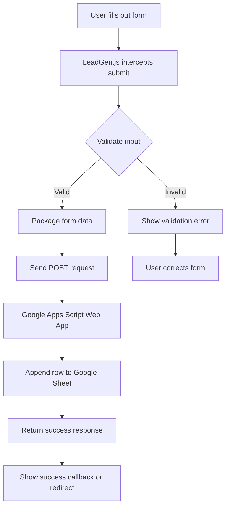

<p align="center">
  
</p>

<p align="center">
  <a href="https://github.com/NileGazer00/leadgen.js/blob/main/LICENSE">
    
  </a>
  <a href="https://bundlephobia.com/package/leadgen-js">
    
  </a>
  <a href="https://github.com/NileGazer00/leadgen.js/stargazers">
    
  </a>
  <a href="https://github.com/NileGazer00/leadgen.js/actions">
    
  </a>
</p>

<p align="center">
  <strong>Zero-dependency JavaScript library for capturing leads directly to Google Sheets</strong><br />
  MIT License • Zero Dependencies • Vanilla JS • No Backend
</p>

<p align="center">
  <a href="#home">Home</a> •
  <a href="#getting-started">Getting Started</a> •
  <a href="#installation">Installation</a> •
  <a href="#google-sheets-setup">Google Sheets Setup</a> •
  <a href="#api-reference">API Reference</a> •
  <a href="#examples">Examples</a> •
  <a href="#configuration">Configuration</a> •
  <a href="#troubleshooting">Troubleshooting</a> •
  <a href="#faq">FAQ</a>
</p>

---

## Home

**LeadGen.js** is a lightweight, zero-dependency vanilla JavaScript library for capturing form submissions and sending lead data directly to Google Sheets without any backend infrastructure. It is designed for static sites, landing pages, and JAMstack projects that need a simple lead capture flow. [web:4]

Traditional lead capture usually needs a server, database, and API endpoints, but LeadGen.js uses Google Sheets as a no-code backend instead. Its setup is aimed at frontend developers who want to submit form data from plain HTML, React, Vue, Angular, Svelte, or vanilla JavaScript. [web:4]

## Why LeadGen.js

- Zero dependencies, no npm packages required for basic use.
- No backend required, because Google Sheets acts as the database.
- Framework agnostic, so it works with React, Vue, Angular, Svelte, and plain HTML.
- Lightweight enough for fast-loading sites.
- Built-in validation, theme support, analytics, and CDN usage.
- MIT licensed for personal and commercial projects.

## Core Workflow



### Diagram explanation

- The user starts by submitting a normal HTML form.
- LeadGen.js intercepts the submit event so the page does not need a backend.
- Validation runs first, so bad input can be blocked before sending.
- If the form is valid, LeadGen.js converts the fields into request data and sends it to your Google Apps Script web app.
- The web app writes the lead into your Google Sheet and returns a success response.
- On success, LeadGen.js can show a message, reset the form, or redirect the user.

## Features

- 🚀 Zero Backend — Google Sheets is your database.
- ⚡ Lightweight — under 3KB minified and gzipped.
- 🎨 Themes — light, dark, or custom CSS.
- ✅ Built-in Validation — required fields and email format support.
- 📊 Analytics — submission counters and conversion rate.
- 🔒 Concurrency-safe — uses lock handling to prevent lost writes.
- 🌐 Framework Agnostic — works in modern frontend stacks.
- 📦 CDN / npm — easy to install and deploy.

## Getting Started

You only need a Google account, a Google Sheet, and a basic HTML form. No server and no database are required.

### Step 1: Create your form

```html
<form id="lead-form">
  <input type="text" name="fullName" placeholder="Full name" required>
  <input type="email" name="email" placeholder="Email address" required>
  <button type="submit">Submit</button>
</form>
```

### Step 2: Load LeadGen.js

```html
<script src="https://cdn.jsdelivr.net/gh/NileGazer00/leadgen.js/leadgen.js"></script>
<script>
  LeadGen.init({
    formId: "lead-form",
    sheetUrl: "YOUR_GOOGLE_APPS_SCRIPT_WEB_APP_URL",
    theme: "light",
    validate: true,
    debug: false
  });
</script>
```

### Step 3: Submit and verify

When the form is submitted, the data is sent to your Google Apps Script web app, which writes the entry into Google Sheets. You can check the sheet to confirm the new row was added.

## Installation

### CDN

```html
<script src="https://cdn.jsdelivr.net/gh/NileGazer00/leadgen.js/leadgen.js"></script>
```

### Version-pinned CDN

```html
<script src="https://cdn.jsdelivr.net/gh/NileGazer00/leadgen.js@1.0.0/leadgen.js"></script>
```

### ES Module

```html
<script type="module">
  import { LeadGen } from "https://cdn.jsdelivr.net/gh/NileGazer00/leadgen.js/leadgen.module.js";

  LeadGen.init({
    formId: "my-form",
    sheetUrl: "YOUR_WEB_APP_URL"
  });
</script>
```

### npm / bundlers

```bash
npm install leadgen-js
```

```javascript
const { LeadGen } = require("leadgen-js")
```

```javascript
import { LeadGen } from "leadgen-js"
```

## Google Sheets Setup

Set up a Google Sheet to receive form submissions.

### Step 1: Create a sheet

Create a spreadsheet and add column headers in row 1. Use field names that match your form input `name` attributes exactly.

```text
firstName | lastName | email | phone | interest | message | timestamp
```

### Step 2: Open Apps Script

In Google Sheets, go to **Extensions → Apps Script** and paste your server-side script.

### Step 3: Deploy as Web App

Deploy the script as a web app, set **Execute as: Me**, and set **Who has access: Anyone** so form submissions can reach it. Without public access, anonymous submissions will fail. [web:14]

### Step 4: Test the web app

Open the deployment URL in your browser. If it is working, it should return a simple active status response.

## API Reference

### `LeadGen.init(config)`

Initializes LeadGen.js on a form element.

#### Options

| Parameter | Type | Required | Default | Description |
|---|---|---:|---|---|
| `formId` | String | Yes | `null` | ID of the form element. |
| `sheetUrl` | String | Yes | `null` | Google Apps Script web app URL. |
| `theme` | String | No | `"light"` | `"light"`, `"dark"`, or `"none"`. |
| `validate` | Boolean | No | `true` | Enables built-in validation. |
| `debug` | Boolean | No | `false` | Enables console logging. |
| `onSuccess` | Function | No | `null` | Runs after successful submission. |
| `onError` | Function | No | `null` | Runs when submission fails. |
| `customHeaders` | Object | No | `{}` | Extra request headers. |
| `timeout` | Number | No | `10000` | Request timeout in milliseconds. |
| `redirectUrl` | String | No | `null` | Redirect after success. |
| `resetForm` | Boolean | No | `true` | Resets fields after success. |
| `disableOnSubmit` | Boolean | No | `true` | Disables submit button while sending. |

### `LeadGen.calculateNeeded(target, avg)`

Calculates the number of leads needed to reach a revenue target.

```javascript
var leads = LeadGen.calculateNeeded(21000, 499)
console.log(leads)
```

### `LeadGen.setTheme(theme)`

Changes the form theme at runtime.

```javascript
LeadGen.setTheme("dark")
```

### `LeadGen.getAnalytics()`

Returns session analytics such as attempts, successes, failures, and conversion rate.

### `LeadGen.destroy()`

Removes event listeners and resets the instance.

### `LeadGen.validateForm(formId)`

Manually validates a form and returns validation results.

## Examples

### Basic contact form

```html
<form id="basic-form">
  <input type="text" name="name" placeholder="Your Name" required>
  <input type="email" name="email" placeholder="Email" required>
  <textarea name="message" placeholder="Message"></textarea>
  <button type="submit">Send</button>
</form>
```

```html
<script src="https://cdn.jsdelivr.net/gh/NileGazer00/leadgen.js/leadgen.js"></script>
<script>
  LeadGen.init({
    formId: "basic-form",
    sheetUrl: "YOUR_WEB_APP_URL"
  })
</script>
```

### React example

```javascript
import React, { useEffect } from "react"

function LeadForm() {
  useEffect(() => {
    const script = document.createElement("script")
    script.src = "https://cdn.jsdelivr.net/gh/NileGazer00/leadgen.js/leadgen.js"
    script.onload = () => {
      LeadGen.init({
        formId: "react-lead-form",
        sheetUrl: "YOUR_WEB_APP_URL",
        validate: true
      })
    }
    document.body.appendChild(script)
    return () => LeadGen.destroy()
  }, [])

  return (
    <form id="react-lead-form">
      <input type="text" name="name" placeholder="Name" required />
      <input type="email" name="email" placeholder="Email" required />
      <button type="submit">Submit</button>
    </form>
  )
}
```

### Vue example

```javascript
export default {
  mounted() {
    const script = document.createElement("script")
    script.src = "https://cdn.jsdelivr.net/gh/NileGazer00/leadgen.js/leadgen.js"
    script.onload = () => {
      LeadGen.init({
        formId: "vue-lead-form",
        sheetUrl: "YOUR_WEB_APP_URL"
      })
    }
    document.head.appendChild(script)
  },
  beforeUnmount() {
    LeadGen.destroy()
  }
}
```

## Configuration

| Option | Type | Default | Description |
|---|---|---|---|
| `theme` | String | `"light"` | Theme applied to the form. |
| `validate` | Boolean | `true` | Enables built-in validation. |
| `debug` | Boolean | `false` | Enables logging. |
| `redirectUrl` | String | `null` | Redirect target after success. |
| `resetForm` | Boolean | `true` | Resets the form after submission. |
| `disableOnSubmit` | Boolean | `true` | Disables the submit button during requests. |

## Troubleshooting

- **Form submission failed**: Check the web app URL and verify that the script is deployed correctly.
- **401 Unauthorized**: Re-deploy the Apps Script and set access to **Anyone**. [web:14]
- **Data not appearing**: Make sure your form field names match the Google Sheet headers exactly.
- **Page reloads on submit**: Confirm `LeadGen.init()` runs after the form exists in the DOM.
- **Validation issues**: Adjust HTML constraints or set `validate: false`.

## FAQ

### Is LeadGen.js free?

Yes. It is MIT licensed and free for personal and commercial use.

### Does it work with frameworks?

Yes. It works with React, Vue, Angular, Svelte, and vanilla JS.

### Can I use it on GitHub Pages?

Yes. It is designed for static hosting platforms such as GitHub Pages, Netlify, Vercel, and Cloudflare Pages.

### Is my data secure?

Your Google Sheet stays private. The web app receives submissions, but users cannot directly browse your sheet.

### Does it support file uploads?

No. This library is focused on text-based form submissions.

## Contributing

Contributions are welcome. To contribute:

1. Fork the repository.
2. Create a feature branch.
3. Make your changes.
4. Test in multiple browsers.
5. Submit a pull request.

## Live Demo & Docs

- Repo: [github.com/NileGazer00/leadgen.js](https://github.com/NileGazer00/leadgen.js)
- Site: [nilegazer00.github.io/NileGazer00-js-leadmachine/](https://nilegazer00.github.io/NileGazer00-js-leadmachine/)

## License

Released under the MIT License.
