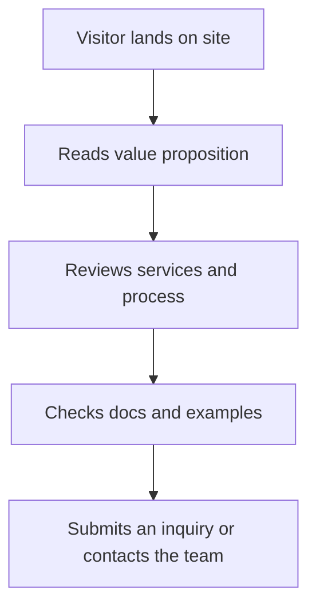

# LeadGen.js

Modern lead generation and outreach site for high-converting landing pages.

[](https://leadgen.js.org)
[](#deployment)
[](#license)
[](#)

## Overview

LeadGen.js is a fast, responsive marketing site designed to present lead generation services, explain the process clearly, and convert visitors into inquiries.

It includes a clean homepage, supporting documentation pages, and a simple static architecture that is easy to maintain and expand.

## How it works



## Features

- Conversion-focused homepage.
- Organized documentation pages for setup, examples, and API reference.
- Responsive layout for desktop and mobile.
- Simple static stack with HTML, CSS, and JavaScript.
- Easy deployment with GitHub Pages.

## Project structure

- `index.html` — Main landing page.
- `assets/` — Shared styles and scripts.
- `docs/` — Supporting documentation pages.
- `CNAME` — Custom domain configuration.

## Getting started

### 1. Clone the repository

```bash
git clone https://github.com/your-username/leadgen.js.git
cd leadgen.js
```

### 2. Open the site locally

Open `index.html` in your browser, or serve the project with a local web server.

### 3. Customize the content

Update branding, copy, contact details, and documentation pages to match your business.

## Documentation

- [Getting Started](docs/getting-started.html)
- [Installation](docs/installation.html)
- [API Reference](docs/api-reference.html)
- [Examples](docs/examples.html)
- [Troubleshooting](docs/troubleshooting.html)
- [Google Sheets Setup](docs/google-sheets-setup.html)

## Deployment

This project is deployed with GitHub Pages using the custom domain `leadgen.js.org`.

- Keep the `CNAME` file set to `leadgen.js.org`.
- Set the custom domain in the repository’s Pages settings.
- Confirm your DNS points correctly to GitHub Pages.

## Troubleshooting

If the site does not display correctly:
- Confirm all asset paths are correct.
- Make sure the `docs/` and `assets/` folders are included in deployment.
- Check browser console errors for missing files or script issues.

## Contributing

Contributions are welcome. Submit a pull request with a clear description of the changes.

## License

Licensed under the MIT License.
